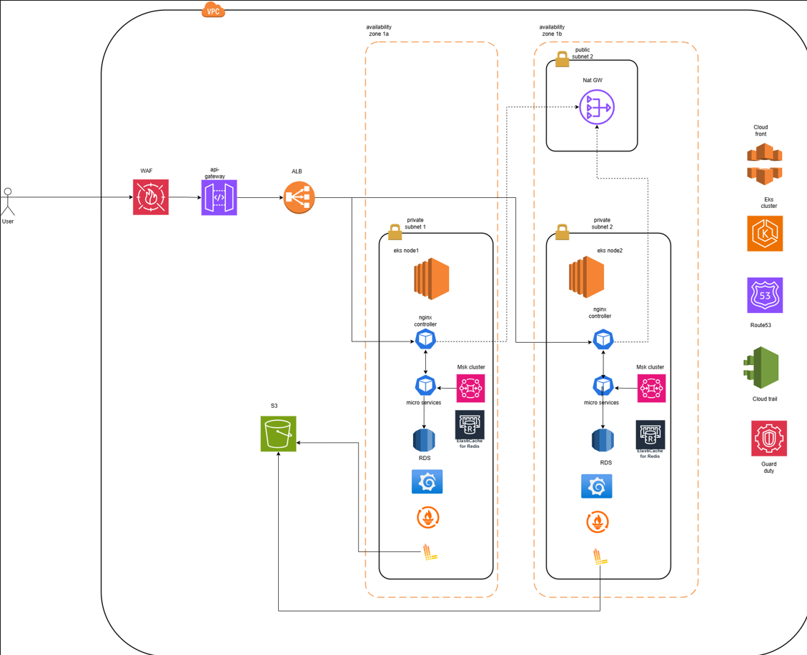

Provide your solution here:
Architecture diagram

Architecture elaboration
This architecture consisder using as much opensource tool as possible to minimize the infrastructure cost, alternatively we can consider enterprise tool with good features and support
1. Global Distribution & Security

AWS Route 53 → DNS routing with global failover.

AWS CloudFront → CDN for faster content delivery.

AWS WAF → Web Application Firewall to prevent attacks.

2. Networking & Load Balancing

AWS VPC → Public and private subnets.

AWS Application Load Balancer (ALB) → Distributes traffic.

AWS API Gateway → Handles WebSocket, REST, and FIX protocol requests.

3. Core Trading Components

AWS EKS (Kubernetes) → Runs microservices.

Nginx controller -> reverse proxy handling traffics

Alternative:
Traefix if you we more lightweigt proxy

4. Database & Storage

Amazon RDS (PostgreSQL) → Transaction storage.

Amazon ElastiCache (Redis) → Low-latency data caching.

Amazon S3 → Log and data archival.

5. Messaging & Event Processing

AWS MSK (Kafka) → Real-time trade data.

Alternative:
AWS SQS

6. Security & Compliance

AWS IAM → Role-based access control.

AWS KMS → Encryption for sensitive data.

AWS CloudTrail & GuardDuty → Security monitoring.

7. Monitoring & Logging

Prometheus & Grafana & Loki → Performance monitoring, logging

Alternative:

Datadog

* Plan for scaling if current setup can't afford traffic
* Implement karpenter autoscaling node base on load
* Horizontal Pod Autoscaling (HPA) in EKS → Scale Kubernetes pods dynamically.
* Global AWS Regions & Multi-AZ Deployments → Expand globally with minimal latency.
* Read Replicas & Database Sharding → Improve database scalability and performance.
* Caching Strategy → Optimize latency with ElastiCache and CloudFront.